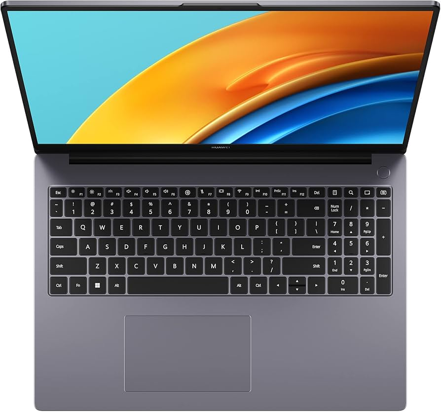

<h1 align="center">Huawei MateBook D16 — Special Keys on Linux</h1>

<p align="center">
  
  
  
  
  
</p>

<p align="center">Guía paso a paso para configurar las teclas especiales del MateBook D16 en Linux.</p>

<p align="center">
  
</p>

---

## Índice

1. [El Problema](#el-problema)
2. [La Solución](#la-solución)
3. [Compatibilidad](#compatibilidad)
4. [Requisitos](#requisitos)
5. [Estructura del proyecto](#estructura-del-proyecto)
6. [Paso 1 — hwdb](#paso-1--hwdb)
7. [Paso 2 — Instalar keyd](#paso-2--instalar-keyd)
8. [Paso 3 — Configurar keyd](#paso-3--configurar-keyd)
9. [Paso 4 — Script del lanzador](#paso-4--script-del-lanzador)
10. [Paso 5 — Daemon Python](#paso-5--daemon-python)
11. [Paso 6 — Servicio systemd](#paso-6--servicio-systemd)
12. [Paso 7 — Script cámara](#paso-7--script-cámara)
13. [Paso 8 — Permisos grupo input](#paso-8--permisos-grupo-input)
14. [Configuración por entorno](#configuración-por-entorno)
15. [Estado Final](#estado-final)
16. [Limitaciones](#limitaciones)
17. [Solución de Problemas](#solución-de-problemas)
18. [Herramientas utilizadas](#herramientas-utilizadas)

---

## El Problema

El Huawei MateBook D16 tiene teclas especiales que no funcionan por defecto en Linux. El problema principal es que varias teclas comparten el mismo scancode (`0xf7`), lo que impide diferenciarlas directamente a nivel de kernel.

| Tecla | Scancode (event2) | Scancode (event11) |
|---|---|---|
| F3 / Búsqueda | `0xf7` | — (nada) |
| F7 (micmute) | `0xf7` | `0x287` → `KEY_MICMUTE` |
| F9 (wifi) | `0xf7` | `0x289` → `KEY_WLAN` |
| F10 (config) | `0xf7` | `0x28a` → `KEY_CONFIG` |
| Superhub | `0x74` | — |
| Cámara | `0x75` | — |

El driver `huawei_wmi` (incluido en el kernel) maneja F7/F9/F10 por un segundo dispositivo (`event11`), lo que permite diferenciarlas de F3/Búsqueda monitoreando ambos dispositivos simultáneamente.

---

## La Solución

```
hwdb       → mapea scancodes a keycodes reconocibles
keyd       → intercepta eventos antes que el entorno gráfico
Python     → diferencia F3/Búsqueda de F7/F9/F10 usando múltiples dispositivos
systemd    → mantiene el daemon activo en segundo plano
```

**Lógica de diferenciación:**
- F3/Búsqueda → solo evento en `event2` (teclado AT)
- F7/F9/F10 → evento en `event2` + evento en `event11` (Huawei WMI) casi simultáneos

---

## Compatibilidad

| Entorno | Estado | Notas |
|---|---|---|
| GNOME 49 | Funciona | Requiere desactivar atajo predeterminado. Ver [sección GNOME](#gnome) |
| KDE Plasma 6 | Funciona | Sin ajustes extra |
| XFCE | Debería funcionar | La solución es independiente del entorno gráfico |
| Cinnamon | Debería funcionar | La solución es independiente del entorno gráfico |
| Otros | Debería funcionar | keyd y el daemon Python operan por debajo del DE |

---

## Requisitos

- Python 3
- `python3-evdev`
- `keyd` (compilado desde source)
- `systemd`
- Un lanzador de aplicaciones (Vicinae, KRunner, Ulauncher, Rofi, etc.)

---

## Estructura del proyecto

```
scripts/
  toggle-launcher.sh        # Toggle del lanzador (editar según tu lanzador)
  toggle-camera.sh          # Toggle bloqueo de cámara
  huawei-search-daemon.py

config/
  keyd-default.conf         # Copiar a /etc/keyd/default.conf
  90-huawei-keys.hwdb       # Copiar a /etc/udev/hwdb.d/

systemd/
  huawei-search.service     # Copiar a ~/.config/systemd/user/
```

---

## Paso 1 — hwdb

El hwdb mapea los scancodes del hardware a keycodes que el sistema puede entender.

```bash
sudo nano /etc/udev/hwdb.d/90-huawei-keys.hwdb
```

```
evdev:input:b0011v0001p0001*
 KEYBOARD_KEY_f7=search
 KEYBOARD_KEY_74=calc
 KEYBOARD_KEY_75=camera
```

Aplicar cambios:
```bash
sudo systemd-hwdb update
sudo udevadm trigger
```

Verificar:
```bash
udevadm info /dev/input/event2 | grep KEYBOARD
```

Debe mostrar:
```
E: KEYBOARD_KEY_74=calc
E: KEYBOARD_KEY_75=camera
E: KEYBOARD_KEY_f7=search
```

---

## Paso 2 — Instalar keyd

`keyd` intercepta el teclado a nivel de kernel antes de que el entorno gráfico lo procese.

```bash
cd ~
sudo dnf install git make gcc   # Fedora
# sudo apt install git make gcc # Ubuntu/Debian
git clone https://github.com/rvaiya/keyd
cd keyd
make && sudo make install
sudo systemctl enable keyd --now
```

---

## Paso 3 — Configurar keyd

### Encontrar el ID del teclado

```bash
sudo journalctl -u keyd -n 30 | grep -i "match\|keyboard"
```

Si el comando no devuelve nada, ver el log completo:

```bash
sudo journalctl -u keyd
```

Buscar la línea que menciona `AT Translated Set 2 keyboard`:

```
keyd[32934]: DEVICE: ignoring 0001:0001:09b4e68d  (AT Translated Set 2 keyboard)
```

El ID es el valor en formato `XXXX:XXXX:XXXXXXXX` que aparece antes del nombre del dispositivo. En el ejemplo anterior sería `0001:0001:09b4e68d`.

### Configuración

```bash
sudo nano /etc/keyd/default.conf
```

```
[ids]
0001:0001:09b4e68d

[main]
search = command(/home/<usuario>/.local/bin/toggle-launcher.sh)
```

> **Nota:** El ID `0001:0001:09b4e68d` es un ejemplo. Reemplazarlo con el ID obtenido en el paso anterior — puede variar entre sistemas. Reemplazar también `<usuario>` con tu nombre de usuario.

```bash
sudo systemctl restart keyd
```

---

## Paso 4 — Script del lanzador

```bash
mkdir -p ~/.local/bin
nano ~/.local/bin/toggle-launcher.sh
```

Elige el lanzador que uses y descomenta la línea correspondiente:

```bash
#!/bin/bash
export XDG_RUNTIME_DIR=/run/user/$(id -u)

# ── Elige tu lanzador ──────────────────────────────
# vicinae toggle          # Vicinae
# krunner               # KRunner (KDE)
# ulauncher-toggle      # Ulauncher
# rofi -show drun       # Rofi
# wofi --show drun      # Wofi (Wayland)
# ───────────────────────────────────────────────────
```

```bash
chmod +x ~/.local/bin/toggle-launcher.sh
```

Probar:
```bash
~/.local/bin/toggle-launcher.sh
```

---

## Paso 5 — Daemon Python

Instalar la dependencia `python3-evdev`:

```bash
sudo dnf install python3-evdev   # Fedora
# sudo apt install python3-evdev # Ubuntu/Debian
```

```bash
nano ~/.local/bin/huawei-search-daemon.py
```

```python
#!/usr/bin/env python3
"""
Huawei MateBook D16 — Search Key Daemon
========================================
Diferencia las teclas F3/Búsqueda de F7/F9/F10 en Linux.

Problema: Todas mandan el mismo scancode (0xf7) por el teclado AT.
Solución: Monitorear ambos dispositivos simultáneamente.
  - F3/Búsqueda → solo evento en teclado AT (event2)
  - F7/F9/F10   → evento en teclado AT + evento en Huawei WMI (event11)

Dependencias: python3-evdev, keyd
"""

import evdev
import subprocess
import threading
import time
import os
import sys

# ─────────────────────────────────────────
# Configuración
# ─────────────────────────────────────────

# Tiempo máximo (segundos) entre search_down y evento Huawei
# para considerar que es F7/F9/F10 y no F3/Búsqueda
HUAWEI_WINDOW = 0.05

# Cooldown entre activaciones para evitar doble disparo
COOLDOWN = 0.3

# Script a ejecutar al detectar F3/Búsqueda
SCRIPT_PATH = os.path.join(os.path.expanduser("~"), ".local/bin/toggle-launcher.sh")

# ─────────────────────────────────────────
# Estado compartido entre hilos
# ─────────────────────────────────────────

# Timestamp del último evento del driver Huawei WMI
huawei_event_time = 0.0

# Timestamp del último KEY_SEARCH DOWN
search_down_time = 0.0

# Timestamp de la última ejecución (para cooldown)
last_trigger = 0.0


# ─────────────────────────────────────────
# Búsqueda dinámica de dispositivos
# ─────────────────────────────────────────

def find_device(name: str):
    """
    Busca un dispositivo de input por nombre.
    Más portable que hardcodear /dev/input/eventN,
    ya que los números pueden cambiar entre reinicios.
    """
    for path in evdev.list_devices():
        try:
            dev = evdev.InputDevice(path)
            if name in dev.name:
                return dev
        except Exception:
            pass
    return None


# ─────────────────────────────────────────
# Hilo monitor del driver Huawei WMI
# ─────────────────────────────────────────

def watch_huawei(dev) -> None:
    """
    Monitorea el dispositivo Huawei WMI hotkeys en un hilo separado.
    Registra el timestamp de cualquier KEY_DOWN.

    F7  → KEY_MICMUTE (248)  → silencia micrófono (manejado por driver)
    F9  → KEY_WLAN    (238)  → toggle WiFi (manejado por driver)
    F10 → KEY_CONFIG  (171)  → abre configuración (manejado por driver)

    Estos eventos llegan casi simultáneamente con KEY_SEARCH de event2
    cuando se presiona F7/F9/F10, permitiendo identificarlas.
    """
    global huawei_event_time
    for event in dev.read_loop():
        if event.type == evdev.ecodes.EV_KEY and event.value == 1:
            huawei_event_time = time.time()


# ─────────────────────────────────────────
# Inicialización
# ─────────────────────────────────────────

huawei = find_device("Huawei WMI hotkeys")
keyboard = find_device("AT Translated Set 2 keyboard")

if not huawei or not keyboard:
    print("Error: dispositivos de input no encontrados.")
    print("Se requieren:")
    print("  - Huawei WMI hotkeys")
    print("  - AT Translated Set 2 keyboard")
    sys.exit(1)

# Iniciar hilo del driver Huawei
t = threading.Thread(target=watch_huawei, args=(huawei,), daemon=True)
t.start()


# ─────────────────────────────────────────
# Loop principal — teclado AT
# ─────────────────────────────────────────

for event in keyboard.read_loop():
    # Solo eventos de teclas
    if event.type != evdev.ecodes.EV_KEY:
        continue

    # Solo KEY_SEARCH (mapeado por hwdb desde scancode 0xf7)
    if event.code != evdev.ecodes.KEY_SEARCH:
        continue

    # KEY DOWN: registrar timestamp de inicio de pulsación
    if event.value == 1:
        search_down_time = time.time()

    # KEY UP: decidir si ejecutar o ignorar
    elif event.value == 0:
        # Si Huawei WMI emitió un evento entre el DOWN y el UP,
        # es F7/F9/F10 → ignorar.
        # F3/Búsqueda no generan eventos en Huawei WMI.
        if huawei_event_time > 0 and \
           0 <= (huawei_event_time - search_down_time) < HUAWEI_WINDOW:
            continue

        # Cooldown para evitar múltiples ejecuciones
        now = time.time()
        if now - last_trigger > COOLDOWN:
            last_trigger = now
            subprocess.Popen(['bash', SCRIPT_PATH])
```

```bash
chmod +x ~/.local/bin/huawei-search-daemon.py
```

---

## Paso 6 — Servicio systemd

```bash
mkdir -p ~/.config/systemd/user
nano ~/.config/systemd/user/huawei-search.service
```

```ini
[Unit]
Description=Huawei Search Key Daemon
After=graphical-session.target

[Service]
ExecStart=/usr/bin/python3 /home/<usuario>/.local/bin/huawei-search-daemon.py
Restart=always

[Install]
WantedBy=graphical-session.target
```

> Reemplazar `<usuario>` con tu nombre de usuario.

```bash
systemctl --user enable huawei-search --now
systemctl --user status huawei-search
```

---

## Paso 7 — Script cámara

La tecla Cámara ya está mapeada a `KEY_CAMERA` por el hwdb. Este script bloquea/desbloquea el acceso a la cámara con notificación.

```bash
nano ~/.local/bin/toggle-camera.sh
```

```bash
#!/bin/bash

DEVICE="/dev/video0"

if [ -r "$DEVICE" ]; then
    sudo chmod 000 "$DEVICE"
    notify-send -i camera-off "Cámara" "Cámara desactivada"
else
    sudo chmod 660 "$DEVICE"
    notify-send -i camera "Cámara" "Cámara activada"
fi
```

```bash
chmod +x ~/.local/bin/toggle-camera.sh
```

Configurar sudoers para no pedir contraseña:
```bash
sudo visudo
```

Agregar al final (reemplazar `<usuario>`):
```
<usuario> ALL=(ALL) NOPASSWD: /usr/bin/chmod 000 /dev/video0
<usuario> ALL=(ALL) NOPASSWD: /usr/bin/chmod 660 /dev/video0
```

Configurar atajo en KDE:
- **System Settings → Shortcuts → Custom Shortcuts**
- Nuevo atajo global
- Trigger: tecla Cámara (`KEY_CAMERA`)
- Action: `/home/<usuario>/.local/bin/toggle-camera.sh`

---

## Paso 8 — Permisos grupo input

Para que el daemon Python lea los dispositivos de input sin sudo.

```bash
sudo usermod -aG input $USER
```

**Cerrar sesión completamente y volver a entrar.**

Verificar:
```bash
groups | grep input
```

---

## Configuración por entorno

> **Importante:** El daemon Python intercepta la tecla Search a nivel de kernel mediante keyd. Para que funcione correctamente, **es obligatorio deshabilitar el atajo de teclado de la tecla Search en el entorno gráfico**. Si el DE lo captura primero, el script no se ejecutará o se ejecutará en conflicto con el comportamiento nativo del entorno.

### GNOME

GNOME intercepta `KEY_SEARCH` internamente. Desactivar el atajo predeterminado:

```bash
gsettings set org.gnome.settings-daemon.plugins.media-keys search-static "[]"
```

Sin esto, GNOME abrirá su propio overlay de búsqueda además del lanzador configurado.

### KDE Plasma

Verificar que KRunner no tenga asignada la tecla Search como atajo:

- **System Settings → Shortcuts → KRunner**
- Asegurarse de que ningún atajo esté asignado a `KEY_SEARCH`

Si no hay conflicto, no se requiere ningún ajuste adicional.

### Otros entornos (XFCE, Cinnamon, etc.)

Buscar en la configuración de atajos de teclado del entorno y eliminar cualquier atajo asignado a la tecla Search o `KEY_SEARCH`. El procedimiento varía según el DE pero el principio es el mismo.

---

## Estado Final

| Tecla | Estado | Método |
|---|---|---|
| F3 / Búsqueda | Abre lanzador | keyd + daemon Python |
| Superhub | Abre calculadora | hwdb (`KEY_CALC`) — acción modificable |
| Cámara | Bloquea/desbloquea | hwdb + script + atajo DE |
| F7 (micmute) | Silencia micrófono | Driver `huawei_wmi` |
| F9 (wifi) | Toggle WiFi | Driver `huawei_wmi` |
| F10 (config) | Abre configuración | Driver `huawei_wmi` |

---

## Limitaciones

- El sensor de huellas Goodix no funciona en Linux en este modelo.
- La detección depende del timing entre eventos (~50ms). En sistemas muy lentos podría necesitar ajustar `HUAWEI_WINDOW`.
- El script de cámara asume `/dev/video0`. Si tienes múltiples cámaras, ajustar la variable `DEVICE`.
- Probado solo en Fedora 43 y GNOME 49. Otros entornos pueden requerir ajustes.

---

## Solución de Problemas

### El daemon no encuentra los dispositivos
```bash
groups | grep input
# Si no aparece, agregar y reiniciar sesión
sudo usermod -aG input $USER
```

### keyd no intercepta el teclado
```bash
sudo journalctl -u keyd -n 30 | grep -i "match\|ignoring"
# Si dice ignoring para el teclado, verificar el ID
sudo keyd -m
# Presionar cualquier tecla para identificar el dispositivo
```

### F7/F9/F10 siguen abriendo el lanzador
```bash
# Verificar hwdb aplicado
udevadm info /dev/input/event2 | grep KEYBOARD
# En GNOME, desactivar atajo predeterminado
gsettings set org.gnome.settings-daemon.plugins.media-keys search-static "[]"
```

### Vicinae / lanzador no abre
```bash
# Verificar servicio
systemctl --user status vicinae
systemctl --user enable vicinae --now
# Probar script manualmente
~/.local/bin/toggle-launcher.sh
```

### El script de cámara no funciona
```bash
ls /dev/video*
# Ajustar DEVICE en toggle-camera.sh
```

---

## Herramientas utilizadas

### Sistema

<p>
  
</p>

### Entornos de escritorio

<p>
  
  
</p>

### Herramientas

<p>
  
  
  
  
</p>

| Herramienta | Uso |
|---|---|
| `evtest` | Inspeccionar eventos de input |
| `dmesg` | Ver scancodes del kernel |
| `udevadm` | Verificar hwdb |
| `keyd -m` | Monitor de teclas en tiempo real |
| `keyd` | Interceptar teclado a nivel kernel |
| `python3-evdev` | Leer eventos desde Python |
| `systemd --user` | Servicios de usuario |
| `hwdb` | Mapeo de scancodes a keycodes |

---

## Autor

| Nombre | Rol |
|---|---|
| [Guillermo Salado](https://github.com/guillermosalado) | Investigación · Configuración · Documentación |

---

<p align="center">
  <a href="https://github.com/guillermosalado">
    
  </a>
</p>